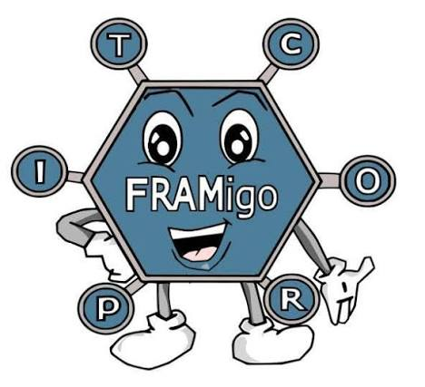
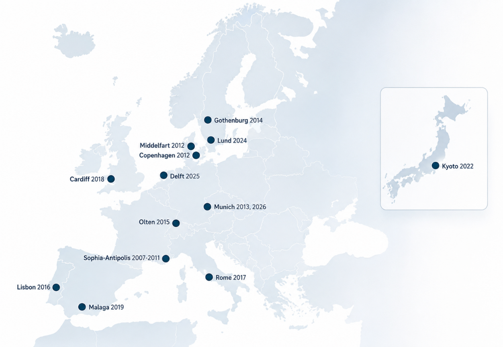
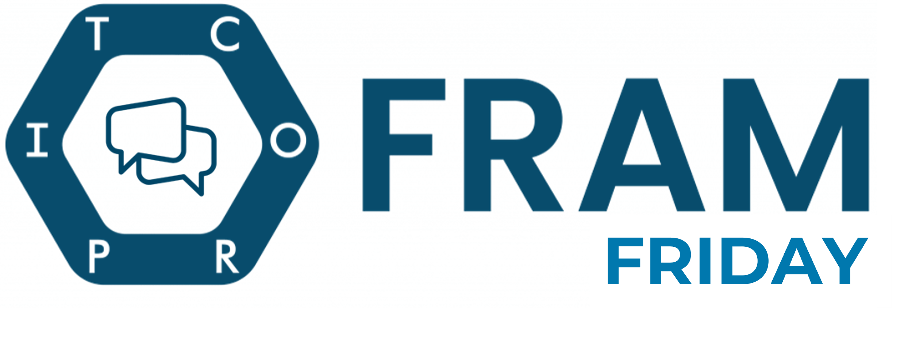
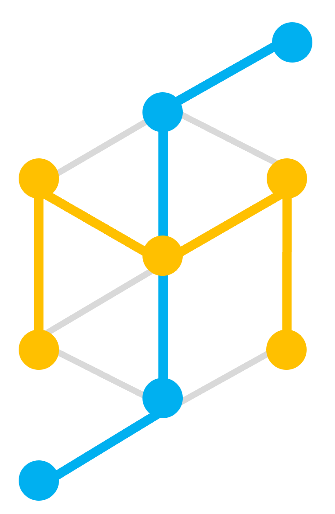

  

# FRAMily Community

### Community discussions, announcements, events, and collaboration within the international FRAM community.

Welcome to the community hub of **FRAMily, the International FRAM Community**.

This repository provides a shared space for discussions, collaboration opportunities, community initiatives, and knowledge exchange related to the **Functional Resonance Analysis Method (FRAM)**.

Researchers, practitioners, educators, developers, and students are invited to ask questions, exchange experiences, showcase their work, explore new ideas, and connect with the international FRAM community.

[Join the FRAMily Discussions](https://github.com/FRAMily-Community/framily-community)

---

## Community Discussions

Join the conversation, share experiences, ask questions, and collaborate with the international FRAM community.

| Discussion Space | Description |
|------------------|-------------|
| 📢 [Announcements](https://github.com/FRAMily-Community/framily-community/discussions/categories/announcements) | Official community updates, events, software releases, and important news. |
| 🎓 [Teaching & Learning](https://github.com/FRAMily-Community/framily-community/discussions/categories/teaching-learning) | Questions and answers on teaching FRAM, educational resources, exercises, and training material. |
| 💻 [Software & Tools](https://github.com/FRAMily-Community/framily-community/discussions/categories/software-tools) | Questions and answers on FRAM software, technical support, and tool development. |
| 🧩 [Model Showcase](https://github.com/FRAMily-Community/framily-community/discussions/categories/model-showcase) | Share FRAM models, case studies, examples, and practical applications from different domains. |
| 🔬 [Research](https://github.com/FRAMily-Community/framily-community/discussions/categories/research) | Discuss research findings, publications, methodologies, and scientific developments related to FRAM and resilience engineering. |
| 🤝 [Collaborations](https://github.com/FRAMily-Community/framily-community/discussions/categories/collaborations) | Research collaborations, project partnerships, student projects, and PhD opportunities. |
| 💡 [Ideas & Future Directions](https://github.com/FRAMily-Community/framily-community/discussions/categories/ideas-future-directions) | Community development ideas, future activities, and FRAM research directions. |
| 🌍 [General Discussion](https://github.com/FRAMily-Community/framily-community/discussions/categories/general-discussion) | Open discussions, experiences, and community exchange. |

💬 **Community Forum:**  
https://github.com/FRAMily-Community/framily-community/discussions

## How to Participate

You are welcome to:

1. Ask or answer a question
2. Introduce an idea or emerging topic
3. Share a FRAM model or application
4. Discuss a publication or research question
5. Find collaborators for a project
6. Request help with software or tools
7. Share teaching and learning resources
8. Contribute constructively to existing discussions

Before starting a new discussion, please check whether a similar topic already exists. Choose the category that best matches the main purpose of the contribution and use a clear, specific title.

---

## Community Principles

The FRAMily community aims to remain open, inclusive, interdisciplinary, and welcoming.

When participating:

- Engage respectfully and constructively
- Welcome different disciplines, domains, and levels of experience
- Distinguish clearly between evidence, interpretation, and personal opinion
- Respect authorship, intellectual contributions, and applicable licences
- Provide context when sharing models, software, or case material
- Avoid sharing confidential, sensitive, proprietary, or personally identifiable information
- Be transparent about known limitations and uncertainties
- Support learning through questions, feedback, and shared experience

The purpose of this space is to support exchange and collaboration, not to define, license, or enforce a single authorised interpretation of FRAM.

---

## Community Activities

The FRAMily community supports knowledge exchange, shared learning, collaboration, and the responsible development and application of FRAM through activities such as:

### FRAMily Meetings

  

The FRAMily Meetings are the annual international gathering of researchers and practitioners interested in the development and application of FRAM and related resilience-based approaches. Since the first meeting in 2007, the FRAMily community has provided a collaborative forum for sharing research results, practical experiences, methodological developments, software tools, and case studies from a wide range of application domains.

The meetings promote open discussion and exchange between academia and industry, bringing together experts from engineering, healthcare, transportation, safety science, organisational studies, and other disciplines concerned with understanding and managing complexity. Over the years, FRAMily Meetings have been hosted in numerous countries across Europe and Asia, reflecting the growing international reach of the FRAM community.

**Next Meeting**: TBA

**Last Meetings**:

- FRAMily Meeting & Workshop 2026 in Munich hosted by Niklas Grabbe at TUM: https://framily-meeting.lfe.ed.tum.de

- FRAMily Meeting & Workshop 2025 in Delft hosted by Arie Adriaensen at TU Delft: https://www.aanmelder.nl/framily-safetyii-2025/home

- FRAMily Meeting & Workshop 2024 in Lund hosted by Anthony Smoker & Rogier Woltjer at Lund University:: https://functionalresonance.com/framily-2024/

More information at: https://functionalresonance.com/framily-meetings/

### FRAM Fridays

  

FRAM Fridays are bimonthly online community sessions for informal knowledge exchange and discussion. They provide a regular and accessible format for continuing conversations between the annual FRAMily Meetings.

**Next FRAM Friday**: TBA; Link: TBA

The sessions may include:

- Invited presentations
- Research and practice updates
- Software, model or case study demonstrations
- Emerging ideas and methodological developments
- Open community discussions
- Opportunities to connect with potential collaborators

All FRAM Friday sessions are recorded and will be uploaded to the [FRAMily Youtube Channel](https://www.youtube.com/@framily-community)

### FRAM Summer School

  

The Summer School on Systems Modelling provides structured education and hands-on training for students, researchers, and early-career professionals interested in FRAM and the modelling of complex socio-technical systems.

Activities may include:

- Foundations of systems thinking and FRAM
- Guided modelling exercises
- Group case studies
- Software tutorials
- Expert feedback
- Interdisciplinary collaboration
- Practical application of FRAM to real-world challenges

Publicly available Summer School resources may be shared through the [FRAM Learning Material repository](https://github.com/FRAMily-Community/fram-learning-material).

> Details, dates, formats, and participation conditions may vary between editions. Please consult the official FRAMily announcements and event pages for current information.

**Next Summer School**: TBA

**Last Summer Schools**:

The first Summer School on Systems Modelling was hosted by Niklas Grabbe at TUM: https://sysmod-summerschool.lfe.ed.tum.de/

### Research and practice collaborations

### Software and tool development

### Model sharing and peer feedback

### Open educational resources

### Cross-domain and interdisciplinary exchange

---> Announcements, follow-up discussions, shared materials, and opportunities related to these activities can be posted in the appropriate Discussion category.
